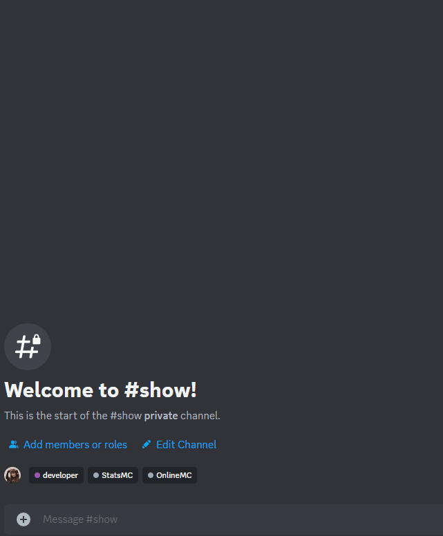

## OnlineMC

This bot provides minecraft online player list in discord.
It requires [server side plugin](https://legacy.curseforge.com/minecraft/bukkit-plugins/onlinemc) to be running on the server.

## Quick start

1. create `aftoken.py` file
2. write replacing `<bot_token>` with your bot's token.

    ```af_token = "<bot_token>"```
3. run `main.py`

### Example

